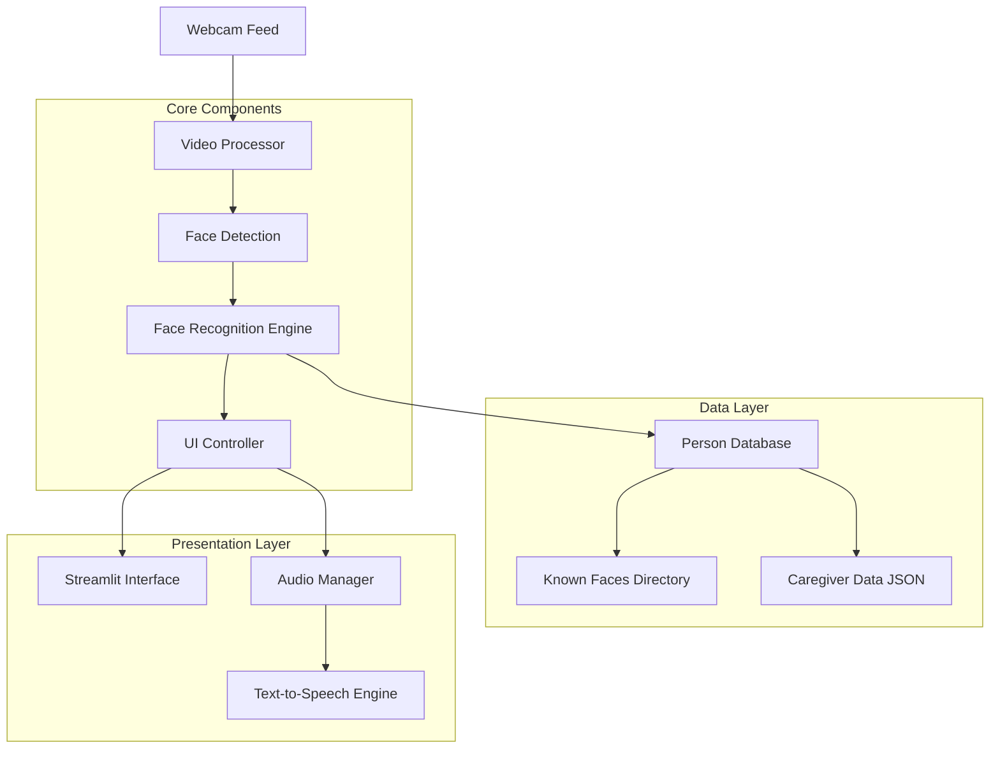
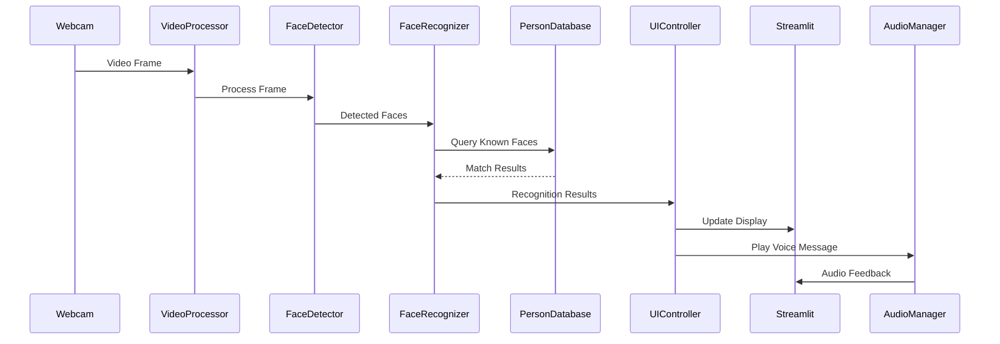

# Memory Mirror Face Recognition - Design Document

## Overview

The Memory Mirror is a real-time face recognition system built using Streamlit for the web interface, OpenCV for video processing, and DeepFace for face recognition. The system continuously monitors a webcam feed, identifies known individuals from a local database, and provides personalized responses through dynamic UI updates and multilingual voice messages.

The architecture follows a modular design with clear separation between video processing, face recognition, data management, and user interface components. The system is designed for live demonstration with emphasis on reliability, performance, and user experience.

## Architecture

### High-Level Architecture



### Component Interaction Flow



## Components and Interfaces

### 1. Video Processing Component

**Purpose:** Manages webcam input and frame processing for face detection.

**Key Classes:**
- `VideoCapture`: Handles webcam initialization and frame capture
- `FrameProcessor`: Processes video frames for optimal face detection

**Interfaces:**
```python
class VideoCapture:
    def initialize_camera(self) -> bool
    def get_frame(self) -> np.ndarray
    def release_camera(self) -> None
    def is_camera_available(self) -> bool

class FrameProcessor:
    def preprocess_frame(self, frame: np.ndarray) -> np.ndarray
    def resize_frame(self, frame: np.ndarray, target_size: tuple) -> np.ndarray
    def enhance_lighting(self, frame: np.ndarray) -> np.ndarray
```

### 2. Face Recognition Engine

**Purpose:** Handles face detection and recognition using DeepFace library.

**Key Classes:**
- `FaceDetector`: Detects faces in video frames
- `FaceRecognizer`: Matches detected faces against known database
- `RecognitionCache`: Caches recognition results for performance

**Interfaces:**
```python
class FaceDetector:
    def detect_faces(self, frame: np.ndarray) -> List[Dict]
    def extract_face_region(self, frame: np.ndarray, face_coords: Dict) -> np.ndarray

class FaceRecognizer:
    def initialize_database(self, known_faces_path: str) -> None
    def recognize_face(self, face_image: np.ndarray) -> RecognitionResult
    def get_confidence_threshold(self) -> float
    def update_database(self) -> None

class RecognitionResult:
    person_id: str
    confidence: float
    is_known: bool
    timestamp: datetime
```

### 3. Person Database Manager

**Purpose:** Manages known faces data and metadata from local storage.

**Key Classes:**
- `PersonDatabase`: Main database interface
- `PersonProfile`: Individual person data structure
- `DatabaseLoader`: Loads data from filesystem

**Interfaces:**
```python
class PersonDatabase:
    def load_known_faces(self, directory_path: str) -> None
    def load_metadata(self, json_path: str) -> None
    def get_person_profile(self, person_id: str) -> PersonProfile
    def get_all_profiles(self) -> List[PersonProfile]
    def refresh_database(self) -> None

class PersonProfile:
    person_id: str
    name: str
    relationship: str
    language_preference: str
    voice_message: str
    photo_path: str
    face_encodings: List[np.ndarray]
```

### 4. UI Controller

**Purpose:** Manages the Streamlit interface and coordinates between components.

**Key Classes:**
- `UIController`: Main interface controller
- `DisplayManager`: Handles UI state and updates
- `LanguageManager`: Manages multilingual content

**Interfaces:**
```python
class UIController:
    def initialize_interface(self) -> None
    def update_display(self, recognition_result: RecognitionResult) -> None
    def show_neutral_state(self) -> None
    def show_person_info(self, profile: PersonProfile) -> None
    def handle_error_state(self, error: Exception) -> None

class DisplayManager:
    def render_video_feed(self, frame: np.ndarray) -> None
    def render_person_card(self, profile: PersonProfile) -> None
    def render_status_message(self, message: str, language: str) -> None
    def apply_theme_styling(self) -> None

class LanguageManager:
    def get_supported_languages(self) -> List[str]
    def translate_text(self, text: str, target_language: str) -> str
    def get_default_messages(self, language: str) -> Dict[str, str]
```

### 5. Audio Manager

**Purpose:** Handles text-to-speech generation and audio playback.

**Key Classes:**
- `AudioManager`: Main audio interface
- `TTSEngine`: Text-to-speech conversion
- `AudioPlayer`: Audio playback management

**Interfaces:**
```python
class AudioManager:
    def play_voice_message(self, message: str, language: str) -> None
    def is_audio_playing(self) -> bool
    def stop_current_audio(self) -> None
    def set_volume(self, volume: float) -> None

class TTSEngine:
    def generate_speech(self, text: str, language: str) -> bytes
    def get_supported_languages(self) -> List[str]
    def set_voice_parameters(self, speed: float, pitch: float) -> None
```

## Data Models

### File Structure
```
memory-mirror/
├── app.py                          # Main Streamlit application
├── requirements.txt                # Python dependencies
├── config/
│   └── settings.json              # Application configuration
├── src/
│   ├── video/
│   │   ├── capture.py             # Video capture functionality
│   │   └── processor.py           # Frame processing
│   ├── recognition/
│   │   ├── detector.py            # Face detection
│   │   ├── recognizer.py          # Face recognition
│   │   └── cache.py               # Recognition caching
│   ├── database/
│   │   ├── manager.py             # Database management
│   │   └── models.py              # Data models
│   ├── ui/
│   │   ├── controller.py          # UI controller
│   │   ├── display.py             # Display management
│   │   └── language.py            # Language support
│   ├── audio/
│   │   ├── manager.py             # Audio management
│   │   └── tts.py                 # Text-to-speech
│   └── utils/
│       ├── config.py              # Configuration utilities
│       └── logging.py             # Logging setup
├── known_faces/                   # Face database
│   ├── deeksha/
│   │   ├── photo1.jpg
│   │   └── photo2.jpg
│   └── sakshi/
│       ├── photo1.jpg
│       └── photo2.jpg
├── data/
│   └── caregiver_data.json        # Person metadata
└── assets/
    ├── default_avatar.png         # Default profile image
    └── audio/                     # Audio files cache
```

### Data Schema

**caregiver_data.json Structure:**
```json
{
  "persons": {
    "deeksha": {
      "name": "Deeksha",
      "relationship": "Daughter",
      "language_preference": "en",
      "voice_message": "Hello! It's so good to see you today!",
      "voice_message_translations": {
        "hi": "नमस्ते! आपको आज देखकर बहुत खुशी हुई!",
        "es": "¡Hola! ¡Es tan bueno verte hoy!"
      }
    },
    "sakshi": {
      "name": "Sakshi",
      "relationship": "Caregiver",
      "language_preference": "hi",
      "voice_message": "Welcome back! How are you feeling today?",
      "voice_message_translations": {
        "hi": "वापस स्वागत है! आज आप कैसा महसूस कर रहे हैं?",
        "en": "Welcome back! How are you feeling today?"
      }
    }
  },
  "settings": {
    "default_language": "en",
    "recognition_threshold": 0.6,
    "audio_enabled": true,
    "message_cooldown_seconds": 30
  }
}
```

**Configuration Schema (settings.json):**
```json
{
  "camera": {
    "device_index": 0,
    "resolution": [640, 480],
    "fps": 30
  },
  "recognition": {
    "model_name": "VGG-Face",
    "detector_backend": "opencv",
    "confidence_threshold": 0.6,
    "distance_metric": "cosine"
  },
  "ui": {
    "theme": "light",
    "update_interval_ms": 100,
    "display_confidence": false
  },
  "audio": {
    "tts_engine": "gtts",
    "volume": 0.8,
    "speech_rate": 1.0
  },
  "languages": {
    "supported": ["en", "hi", "es", "fr"],
    "default": "en"
  }
}
```

## Error Handling

### Error Categories and Responses

1. **Camera Errors**
   - Camera not found: Display error message, suggest checking connections
   - Camera permission denied: Show permission instructions
   - Camera in use: Suggest closing other applications

2. **Recognition Errors**
   - DeepFace model loading failure: Fallback to basic detection, log error
   - Low confidence recognition: Show "Unknown person" state
   - Processing timeout: Skip frame, continue with next

3. **Data Errors**
   - Missing known_faces directory: Create directory, show setup instructions
   - Corrupted caregiver_data.json: Use default values, log corruption
   - Missing person photos: Use default avatar, log missing files

4. **Audio Errors**
   - TTS service unavailable: Continue with visual-only mode
   - Audio device not found: Disable audio features gracefully
   - Language not supported: Fallback to default language

### Error Recovery Strategies

```python
class ErrorHandler:
    def handle_camera_error(self, error: CameraError) -> None
    def handle_recognition_error(self, error: RecognitionError) -> None
    def handle_data_error(self, error: DataError) -> None
    def handle_audio_error(self, error: AudioError) -> None
    def log_error(self, error: Exception, context: str) -> None
    def get_user_friendly_message(self, error: Exception) -> str
```

## Testing Strategy

### Unit Testing Approach

1. **Component Testing**
   - Video capture functionality with mock camera inputs
   - Face detection accuracy with test image sets
   - Recognition engine with known face database
   - Audio generation and playback functionality

2. **Integration Testing**
   - End-to-end recognition workflow
   - UI state transitions and updates
   - Database loading and person profile retrieval
   - Multilingual content rendering

3. **Performance Testing**
   - Frame processing speed benchmarks
   - Recognition latency measurements
   - Memory usage monitoring during extended operation
   - UI responsiveness under load

### Test Data Requirements

- **Test Face Database**: Diverse set of faces for recognition accuracy testing
- **Mock Video Streams**: Pre-recorded video files for consistent testing
- **Language Test Cases**: Sample text in all supported languages
- **Error Simulation**: Mock objects for testing error handling scenarios

### Testing Tools and Frameworks

- **pytest**: Primary testing framework
- **unittest.mock**: Mocking external dependencies
- **opencv-python**: Video processing test utilities
- **streamlit-testing**: UI component testing (if available)

### Continuous Testing Strategy

```python
class TestSuite:
    def test_camera_initialization(self) -> None
    def test_face_detection_accuracy(self) -> None
    def test_recognition_performance(self) -> None
    def test_ui_state_management(self) -> None
    def test_multilingual_support(self) -> None
    def test_error_handling(self) -> None
    def test_audio_playback(self) -> None
    def benchmark_recognition_speed(self) -> None
```

## Performance Considerations

### Optimization Strategies

1. **Video Processing**
   - Frame rate optimization based on system capabilities
   - Adaptive resolution scaling for performance
   - Face detection region of interest (ROI) optimization

2. **Recognition Engine**
   - Face encoding caching to reduce computation
   - Batch processing for multiple faces
   - Recognition result caching with time-based expiration

3. **UI Responsiveness**
   - Asynchronous video processing
   - Efficient Streamlit state management
   - Minimal DOM updates for smooth transitions

4. **Memory Management**
   - Proper cleanup of video frames
   - Limited cache sizes with LRU eviction
   - Garbage collection optimization for long-running sessions

### Performance Metrics

- **Target Frame Rate**: 15-30 FPS depending on system capabilities
- **Recognition Latency**: < 3 seconds for known faces
- **UI Update Time**: < 1 second for state transitions
- **Memory Usage**: < 500MB for extended operation
- **Startup Time**: < 5 seconds for full system initialization